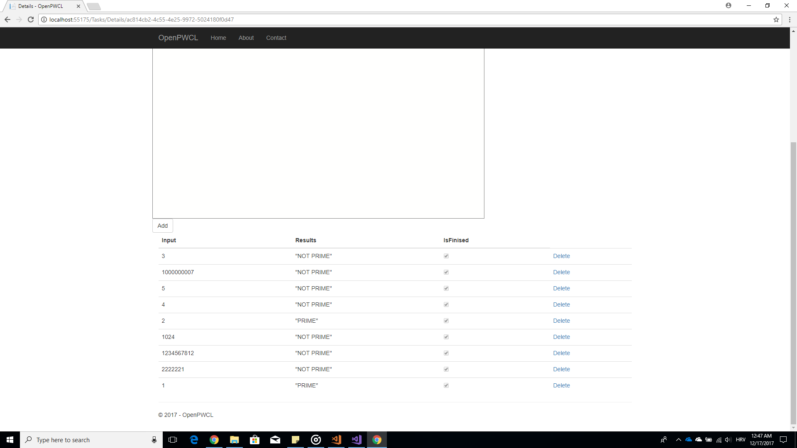

# OpenPWCL Open parallel compute language
### About
This project is made for purposes of class operating systems on university of FER.
Purposes of this project is to find strengths and weaknesses of over the http distributed computing.

### What does it do?
* Long story short, one has list of functions that have one input parameter written in javascript.
* Then, for each function one has list of parameters with which one wants to call that same function. 
* Those functions and input parametes are then sent to clients that go to this web site.
* When sent, those functions are then exicuted with those input parameter.
* When processed, the return value of the function is then sent back to the server.
* The process from step 3 to step 5 is repeated as long as there are unprocessed input parameter.

### Aout the code
Written in 
* c#
*  asp.net core
*  entity framework
* Typescript
*  exicution of functions and client side stuff
* SQL server used db.

### Easiest to build
* Install [Visual studio](https://www.visualstudio.com/)
* Install [Typescript](https://www.typescriptlang.org/)
* Install [B&M](https://github.com/madskristensen/BundlerMinifier)
* Open [solution](src/OpenPWCL.sln)
* Build & Run
### Screenshots
Write ones function.

Write list of parameters for ones functions.

Instances of ones function ready to be processed.

Processed instances of ones function.

### Main author
* Branimir Ričko
* Mail: rickobranimir@gmail.com
 
### License
This project is licensed under [MIT License](LICENSE.md)
